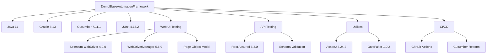

# DemoBlazeAutomationFramework

[](https://github.com/azka-art/DemoBlaze-automation-framework/actions/workflows/api-tests.yml)
[](https://github.com/azka-art/DemoBlaze-automation-framework/actions/workflows/web-tests.yml)
[](https://github.com/azka-art/DemoBlaze-automation-framework/actions/workflows/all-tests.yml)

Sebuah framework otomasi pengujian komprehensif untuk aplikasi web Demoblaze yang mencakup pengujian API dan Web UI menggunakan tools dan praktik terbaik modern.

## 📋 Fitur

- **Pendekatan Pengujian Ganda**: Menguji layer UI dan API dalam satu framework
- **Implementasi BDD**: Menggunakan Cucumber dengan Gherkin untuk skenario pengujian yang mudah dibaca
- **Arsitektur Bersih**: Mengikuti pola Page Object Model dan desain pattern lainnya
- **Pelaporan Robust**: Menghasilkan laporan HTML dan JSON yang detail
- **Integrasi CI/CD**: Workflow GitHub Actions untuk otomatisasi pengujian
- **Maintainability Tinggi**: Kode terstruktur dengan pemisahan concerns yang jelas
- **Generasi Data Dinamis**: Menggunakan Faker untuk menghasilkan data pengujian
- **Pemulihan Kesalahan yang Ditingkatkan**: Mengambil screenshot saat pengujian gagal
- **Dukungan Eksekusi Paralel**: Pengujian dapat berjalan secara paralel untuk feedback yang lebih cepat

## 🛠️ Technology Stack



## 🗂️ Struktur Proyek

```
src/
├── main/
│   ├── java/
│   │   └── com/
│   │       └── demoblaze/
│   │           ├── api/
│   │           │   ├── clients/
│   │           │   ├── models/
│   │           │   └── utils/
│   │           ├── config/
│   │           ├── utils/
│   │           └── web/
│   │               ├── pages/
│   │               └── utils/
│   └── resources/
│       └── config.properties
└── test/
    ├── java/
    │   └── com/
    │       └── demoblaze/
    │           ├── runners/
    │           │   ├── ApiTestRunner.java
    │           │   └── WebTestRunner.java
    │           └── stepdefinitions/
    │               ├── api/
    │               │   ├── LoginApiSteps.java
    │               │   └── SignupApiSteps.java
    │               └── web/
    │                   ├── LoginWebSteps.java
    │                   ├── ProductBrowsingSteps.java
    │                   └── CheckoutSteps.java
    └── resources/
        └── features/
            ├── api/
            │   ├── login.feature
            │   └── signup.feature
            └── web/
                ├── login_web.feature
                ├── product_browsing.feature
                └── checkout_process.feature
```

## 🧪 Test Coverage

### API Tests (10 Scenarios)
1. **Login API** - 5 scenarios
   - Successful login with valid credentials
   - Login with invalid password
   - Login with non-existent user
   - Login with empty credentials
   - Login with special characters

2. **Signup API** - 5 scenarios
   - Successful signup with new user
   - Signup with existing username
   - Signup with empty username
   - Signup with empty password
   - Signup with very long username

### Web UI Tests (11 Scenarios)
1. **Login Web** - 5 scenarios
   - Successful login with valid credentials
   - Login with invalid password
   - Login with non-existent user
   - Login with empty credentials
   - Login with special characters

2. **Product Browsing** - 5 scenarios
   - Browse products by categories
   - View product details
   - Navigate between pages
   - Search for non-existent product
   - Add product to cart

3. **Checkout Process** - 1 scenario
   - Complete e2e checkout process

## 🚀 Memulai

### Prasyarat

- Java 11 atau lebih tinggi
- Gradle 7.0 atau lebih tinggi
- Browser Chrome/Firefox terinstal
- Git

### Setup

1. Clone repository:
   ```bash
   git clone https://github.com/azka-art/DemoBlaze-automation-framework.git
   cd DemoBlaze-automation-framework
   ```

2. Build proyek:
   ```bash
   ./gradlew build
   ```

### Menjalankan Pengujian

#### Menjalankan Pengujian API
```bash
./gradlew apiTests
```

#### Menjalankan Pengujian Web UI
```bash
./gradlew webTests
```

#### Menjalankan Semua Tests
```bash
./gradlew allTests
```

#### Menjalankan dengan Tag Spesifik
```bash
./gradlew test -Dcucumber.filter.tags="@smoke"
```

#### Menjalankan dengan Browser Spesifik
```bash
./gradlew webTests -Dbrowser=firefox
```

#### Menjalankan dalam Mode Headless
```bash
./gradlew webTests -Dheadless=true
```

## 📊 Laporan

Setelah menjalankan pengujian, laporan dihasilkan di:
- **API Reports**: `build/reports/cucumber/api/index.html`
- **Web Reports**: `build/reports/cucumber/web/index.html`
- **JSON Reports**: `build/reports/cucumber/*/cucumber.json`

## 🔄 Continuous Integration

### GitHub Actions Workflows

Framework ini mencakup tiga workflow GitHub Actions:

1. **API Tests** (`api-tests.yml`)
   - Trigger: Pull request & manual
   - Menjalankan 10 skenario API testing

2. **Web UI Tests** (`web-tests.yml`)
   - Trigger: Pull request & manual
   - Menjalankan 11 skenario Web UI testing

3. **All Tests** (`all-tests.yml`)
   - Trigger: Manual only
   - Menjalankan semua test scenarios
   - Generate combined reports

### Artifact Downloads

Semua laporan test tersedia sebagai artifacts yang dapat didownload di GitHub Actions dengan retention period 30 hari.

## 📈 Status Pengujian Terkini

### API Tests: 10 Scenarios
- Login feature: 5 scenarios
- Signup feature: 5 scenarios
- Status: ✅ Passing (dengan handling untuk 500 errors)

### Web UI Tests: 11 Scenarios  
- Login feature: 5 scenarios
- Product browsing: 5 scenarios
- Checkout e2e: 1 scenario
- Status: ✅ Passing

## 🐛 Known Issues

1. **API Response Variations**: Beberapa API endpoint mengembalikan 500 error untuk invalid input
2. **Element Timing**: Beberapa elemen web memerlukan explicit wait
3. **Alert Handling**: JavaScript alerts perlu proper handling

## 🛠️ Pemecahan Masalah

### BOM (Byte Order Mark) Issues
Project ini sudah mengatasi BOM issues dengan:
- Proper UTF-8 encoding
- Git attributes configuration
- EditorConfig settings

### Duplicate Step Definitions
Semua duplicate step definitions sudah di-resolve dengan proper organization antar step classes.

## 💻 Lingkungan Development

- **OS**: Windows 11
- **JDK**: OpenJDK 64-Bit Server VM 21.0.6+7-LTS
- **Gradle**: 8.13
- **Browser**: Chrome 136.0.7103.93
- **IDE**: Visual Studio Code / IntelliJ IDEA

## 📝 Best Practices

1. **Page Object Model**: Semua web elements di-encapsulate dalam page classes
2. **Step Organization**: Pemisahan yang jelas antara API dan Web steps
3. **Data Generation**: Menggunakan Faker untuk test data yang dinamis
4. **Error Handling**: Comprehensive error handling dan reporting
5. **CI/CD Integration**: Automated testing dengan GitHub Actions

## 📝 Lisensi

Proyek ini dilisensikan di bawah Lisensi MIT - lihat file LICENSE untuk detail.

## 👨‍💻 Author

Azka Nur Fathoni - [azka-art](https://github.com/azka-art)

---

**Last Updated**: May 13, 2025  
**Version**: 1.1.0  
**Build Status**: API ✅ | Web UI ✅

