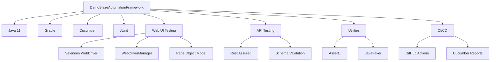
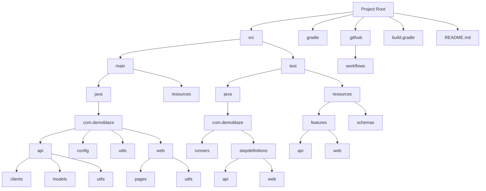
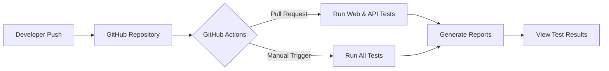
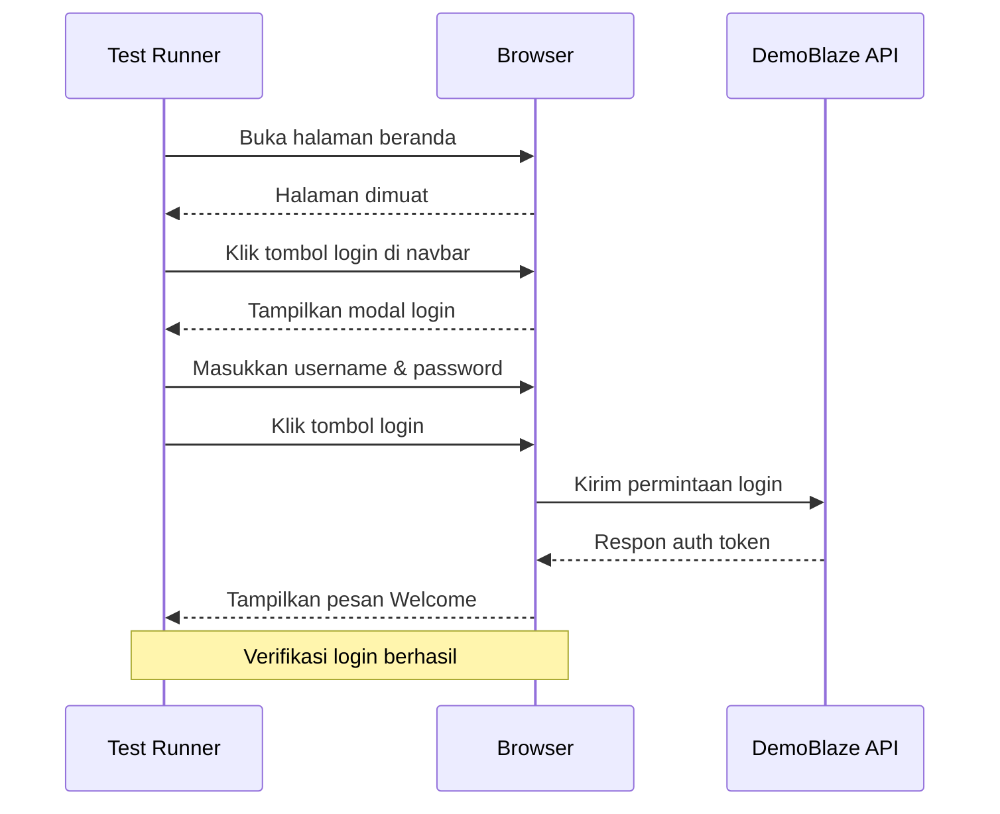
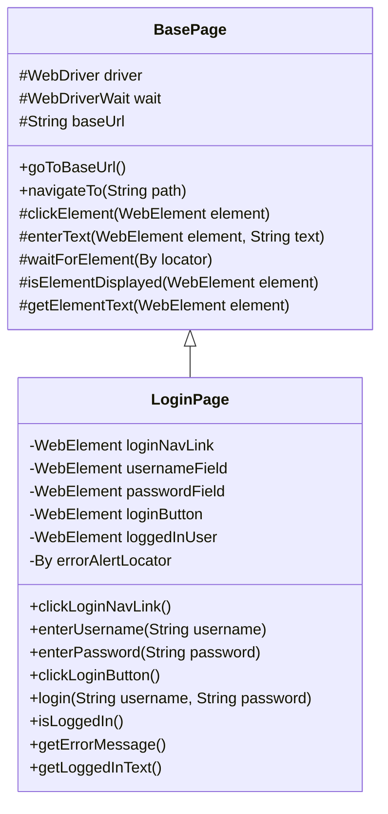
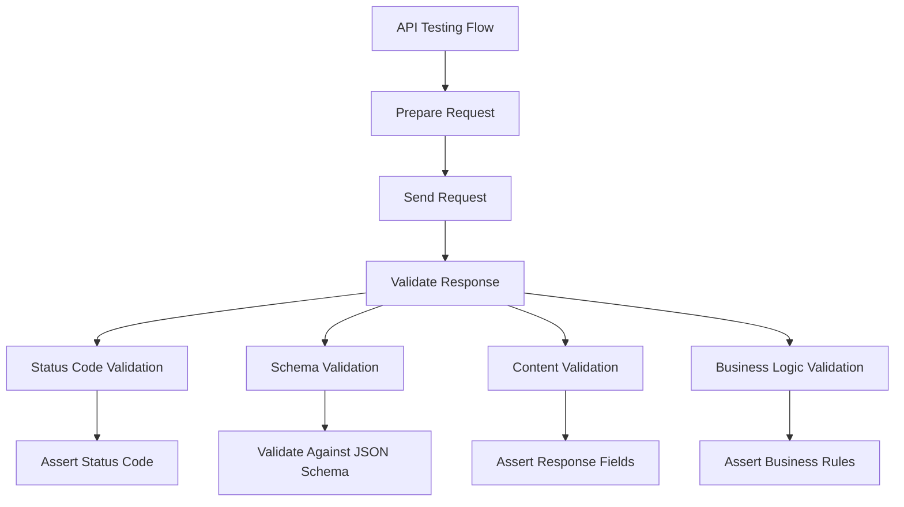
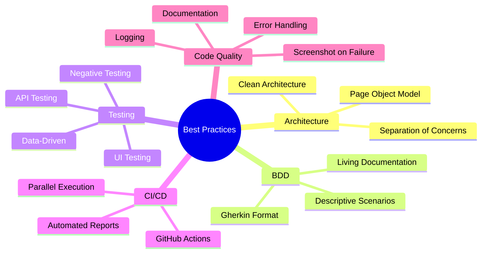

# DemoBlazeAutomationFramework

[](https://github.com/azka-art/DemoBlaze-automation-framework/actions/workflows/api-tests.yml)
[](https://github.com/azka-art/DemoBlaze-automation-framework/actions/workflows/web-tests.yml)
[](https://github.com/azka-art/DemoBlaze-automation-framework/actions/workflows/all-tests.yml)

Sebuah framework otomasi pengujian komprehensif untuk aplikasi web Demoblaze yang mencakup pengujian API dan Web UI menggunakan tools dan praktik terbaik modern.

## 📋 Fitur

- **Pendekatan Pengujian Ganda**: Menguji layer UI dan API dalam satu framework
- **Implementasi BDD**: Menggunakan Cucumber dengan Gherkin untuk skenario pengujian yang mudah dibaca
- **Arsitektur Bersih**: Mengikuti pola Page Object Model dan desain pattern lainnya
- **Pelaporan Robust**: Menghasilkan laporan HTML dan JSON yang detail
- **Integrasi CI/CD**: Workflow GitHub Actions untuk otomatisasi pengujian
- **Maintainability Tinggi**: Kode terstruktur dengan pemisahan concerns yang jelas
- **Generasi Data Dinamis**: Menggunakan Faker untuk menghasilkan data pengujian
- **Pemulihan Kesalahan yang Ditingkatkan**: Mengambil screenshot saat pengujian gagal
- **Dukungan Eksekusi Paralel**: Pengujian dapat berjalan secara paralel untuk feedback yang lebih cepat

## 🛠️ Technology Stack



## 🗂️ Struktur Proyek



Struktur direktori:

```
src/
├── main/
│   ├── java/
│   │   └── com/
│   │       └── demoblaze/
│   │           ├── api/                  # Komponen pengujian API
│   │           │   ├── clients/          # Kelas-kelas API client
│   │           │   ├── models/           # DTO/POJO
│   │           │   └── utils/            # Utilitas API
│   │           ├── config/               # Konfigurasi bersama
│   │           ├── utils/                # Utilitas umum
│   │           └── web/
│   │               ├── pages/            # Page Objects
│   │               └── utils/            # Utilitas Web UI
│   └── resources/
│       └── config.properties             # Properties konfigurasi
└── test/
    ├── java/
    │   └── com/
    │       └── demoblaze/
    │           ├── runners/              # Test runners
    │           │   ├── ApiTestRunner.java
    │           │   └── WebTestRunner.java
    │           └── stepdefinitions/      # Step definitions
    │               ├── api/              # Step definitions API
    │               └── web/              # Step definitions Web UI
    └── resources/
        ├── features/                    # File-file feature
        │   ├── api/                     # File feature API
        │   └── web/                     # File feature Web UI
        └── schemas/                     # JSON schemas untuk validasi
```

## 🚀 Memulai

### Prasyarat

- Java 11 atau lebih tinggi
- Gradle 7.0 atau lebih tinggi
- Browser Chrome/Firefox terinstal

### Setup

1. Clone repository:
   ```bash
   git clone https://github.com/azka-art/DemoBlaze-automation-framework.git
   cd DemoBlaze-automation-framework
   ```

2. Build proyek:
   ```bash
   ./gradlew build
   ```

### Menjalankan Pengujian

#### Menjalankan Pengujian API
```bash
./gradlew apiTests
```

#### Menjalankan Pengujian Web UI
```bash
./gradlew webTests
```

#### Menjalankan dengan Tag Spesifik
```bash
./gradlew test -Dcucumber.filter.tags="@api and @smoke"
```

#### Menjalankan dengan Browser Spesifik
```bash
./gradlew webTests -Dbrowser=firefox
```

#### Menjalankan dalam Mode Headless
```bash
./gradlew webTests -Dheadless=true
```

## 📊 Laporan

Setelah menjalankan pengujian, laporan dihasilkan di:
- Laporan HTML: `build/reports/cucumber/api/index.html` atau `build/reports/cucumber/web/index.html`
- Laporan JSON: `build/reports/cucumber/api/cucumber.json` atau `build/reports/cucumber/web/cucumber.json`
- Laporan Gabungan: `build/reports/cucumber-html-reports/overview-features.html`

## 🔄 Continuous Integration



### GitHub Actions Workflows

Framework ini mencakup tiga workflow GitHub Actions yang telah dioptimalkan untuk performa dan stabilitas:

1. **API Tests** (`api-tests.yml`): 
   - Menjalankan pengujian API
   - Trigger: Pull request & manual
   - Status: ✅ Running

2. **Web UI Tests** (`web-tests.yml`): 
   - Menjalankan pengujian Web UI dengan Selenium
   - Trigger: Pull request & manual
   - Status: ✅ Running

3. **All Tests** (`all-tests.yml`): 
   - Menjalankan semua pengujian secara berurutan
   - Trigger: Manual
   - Status: ✅ Running

Berikut adalah contoh file workflow yang digunakan:

#### api-tests.yml
```yaml
name: API Tests

on:
  workflow_dispatch:  # Manual trigger
  pull_request:       # Run on pull requests
    branches: [ main ]

jobs:
  api-tests:
    runs-on: ubuntu-latest
    
    steps:
    - name: Checkout code
      uses: actions/checkout@v3
      
    - name: Set up JDK 11
      uses: actions/setup-java@v3
      with:
        java-version: '11'
        distribution: 'temurin'
        cache: gradle
        
    - name: Detect UTF-8 BOMs
      run: |
        if grep -rl $'\xEF\xBB\xBF' --include="*.java" --include="*.gradle" --include="*.yml" .; then
          echo "BOM found - please remove"; exit 1;
        fi
        
    - name: Grant execute permission for gradlew
      run: chmod +x gradlew
      
    - name: Build with Gradle
      run: ./gradlew build -x test --warning-mode all
      
    - name: Run API tests
      run: ./gradlew apiTests
      continue-on-error: true
      
    - name: List report files
      if: always()
      run: |
        echo 'Available Report Files:'
        find build/reports/cucumber/api -type f -name "*.html" | sort
```

#### web-tests.yml
```yaml
name: Web UI Tests

on:
  workflow_dispatch:  # Manual trigger
  pull_request:       # Run on pull requests
    branches: [ main ]

jobs:
  web-tests:
    runs-on: ubuntu-latest
    
    steps:
    - name: Checkout code
      uses: actions/checkout@v3
      
    - name: Set up JDK 11
      uses: actions/setup-java@v3
      with:
        java-version: '11'
        distribution: 'temurin'
        cache: gradle
        
    - name: Detect UTF-8 BOMs
      run: |
        if grep -rl $'\xEF\xBB\xBF' --include="*.java" --include="*.gradle" --include="*.yml" .; then
          echo "BOM found - please remove"; exit 1;
        fi
        
    - name: Grant execute permission for gradlew
      run: chmod +x gradlew
      
    - name: Build with Gradle
      run: ./gradlew build -x test --warning-mode all
      
    - name: Setup Chrome
      uses: browser-actions/setup-chrome@latest
      
    - name: Run Web UI tests
      run: ./gradlew webTests -Dheadless=true -Dbrowser=chrome
      continue-on-error: true
      
    - name: List report files
      if: always()
      run: |
        echo 'Available Report Files:'
        find build/reports/cucumber/web -type f -name "*.html" | sort
```

#### all-tests.yml
```yaml
name: Run All Tests

on:
  workflow_dispatch:  # Manual trigger only

jobs:
  api-tests:
    runs-on: ubuntu-latest
    
    steps:
    - name: Checkout code
      uses: actions/checkout@v3
      
    - name: Set up JDK 11
      uses: actions/setup-java@v3
      with:
        java-version: '11'
        distribution: 'temurin'
        cache: gradle
        
    - name: Detect UTF-8 BOMs
      run: |
        if grep -rl $'\xEF\xBB\xBF' --include="*.java" --include="*.gradle" --include="*.yml" .; then
          echo "BOM found - please remove"; exit 1;
        fi
        
    - name: Grant execute permission for gradlew
      run: chmod +x gradlew
      
    - name: Build with Gradle
      run: ./gradlew build -x test --warning-mode all
      
    - name: Run API tests
      run: ./gradlew apiTests
      continue-on-error: true
      
    - name: List API report files
      if: always()
      run: |
        echo 'Available API Report Files:'
        find build/reports/cucumber/api -type f -name "*.html" | sort
  
  web-tests:
    runs-on: ubuntu-latest
    needs: api-tests  # Run after API tests complete
    
    steps:
    - name: Checkout code
      uses: actions/checkout@v3
      
    - name: Set up JDK 11
      uses: actions/setup-java@v3
      with:
        java-version: '11'
        distribution: 'temurin'
        cache: gradle
        
    - name: Detect UTF-8 BOMs
      run: |
        if grep -rl $'\xEF\xBB\xBF' --include="*.java" --include="*.gradle" --include="*.yml" .; then
          echo "BOM found - please remove"; exit 1;
        fi
        
    - name: Grant execute permission for gradlew
      run: chmod +x gradlew
      
    - name: Build with Gradle
      run: ./gradlew build -x test --warning-mode all
      
    - name: Setup Chrome
      uses: browser-actions/setup-chrome@latest
      
    - name: Run Web UI tests
      run: ./gradlew webTests -Dheadless=true -Dbrowser=chrome
      continue-on-error: true
      
    - name: List Web report files
      if: always()
      run: |
        echo 'Available Web Report Files:'
        find build/reports/cucumber/web -type f -name "*.html" | sort
```

## 🧪 Contoh Skenario Pengujian

### Alur Pengujian Login



### Pengujian API
```gherkin
@api @smoke
Scenario: Successful login with valid credentials
  Given I have valid user credentials
  When I send a login request to the API
  Then the API response status code should be 200
  And the API response should contain auth token
```

### Pengujian Web UI
```gherkin
@web @smoke
Scenario: Successful login with valid credentials
  Given I am on the Demoblaze homepage
  When I click on the login button in the navigation bar
  And I enter valid username "testuser" and password "testpassword"
  And I click the login button
  Then I should be logged in successfully
  And I should see "Welcome testuser" message
```

## 📝 Implementasi Detail

### Page Object Pattern



### API Client

```java
public class ApiClient {
    private RequestSpecification request;
    
    // Metode untuk membuat permintaan API
    public Response post(String endpoint) {
        response = request.post(endpoint);
        return response;
    }
    
    // ... metode lainnya
}
```

## 📸 Screenshot Failure Capture

Framework ini secara otomatis mengambil screenshot ketika pengujian UI gagal, membantu analisis dan debugging. Screenshot disimpan sebagai lampiran dalam laporan Cucumber.

```java
@After
public void tearDown(Scenario scenario) {
    if (scenario.isFailed()) {
        TakesScreenshot ts = (TakesScreenshot) DriverManager.getDriver();
        byte[] screenshot = ts.getScreenshotAs(OutputType.BYTES);
        scenario.attach(screenshot, "image/png", "failure-screenshot");
    }
    
    DriverManager.quitDriver();
}
```

## 🔍 Validasi API yang Komprehensif



API testing mencakup:
- Validasi kode status
- Validasi isi respons
- Uji kasus positif dan negatif
- Manajemen token otentikasi

```java
@Then("the API response status code should be {int}")
public void theAPIResponseStatusCodeShouldBe(int expectedStatusCode) {
    assertThat(response.getStatusCode())
        .as("API response status code")
        .isEqualTo(expectedStatusCode);
}

@Then("the API response should contain auth token")
public void theAPIResponseShouldContainAuthToken() {
    String token = response.jsonPath().getString("Auth_token");
    assertThat(token)
        .as("Auth token in response")
        .isNotNull()
        .isNotEmpty();
}
```

## 💡 Praktik Terbaik yang Diimplementasikan



1. **Pemisahan Concerns**:
   - API dan Web UI testing dipisahkan secara struktur
   - Config dan utils dibuat modular

2. **Pendekatan Step-by-Step dalam BDD**:
   - Menggunakan bahasa Given-When-Then yang jelas
   - Feature files yang mudah dibaca oleh non-technical stakeholders

3. **Error Handling yang Robust**:
   - Screenshot otomatis saat failure
   - Pesan error yang deskriptif

4. **Clean Code Practices**:
   - Penamaan variabel dan metode yang jelas
   - Dokumentasi yang lengkap
   - Pemisahan tanggung jawab yang jelas

## 🤝 Kontribusi

1. Fork repository
2. Buat branch fitur (`git checkout -b feature/fitur-keren`)
3. Commit perubahan Anda (`git commit -m 'Menambahkan fitur keren'`)
4. Push ke branch (`git push origin feature/fitur-keren`)
5. Buka Pull Request

## 📌 Poin Penting yang Diimplementasikan

- Semua persyaratan tugas akhir terpenuhi
- Struktur kode yang mengikuti prinsip SOLID
- Implementasi tag Cucumber untuk pengujian yang fleksibel
- Strategi reporting yang komprehensif
- Integrasi CI/CD dengan GitHub Actions

## 🛠️ Pemecahan Masalah

### Mengatasi Masalah BOM (Byte Order Mark)

Framework ini telah mengatasi masalah umum terkait BOM (Byte Order Mark) di file Java dan Gradle. BOM dapat menyebabkan error kompilasi dengan pesan:

```
illegal character: '\ufeff'
```

Untuk menghindari masalah ini, pastikan semua file disimpan sebagai UTF-8 tanpa BOM. File konfigurasi berikut membantu memastikan konsistensi:

- `.gitattributes`: Mengatur encoding file untuk Git
- `.editorconfig`: Mengatur encoding dan style kode untuk editor

Dalam GitHub Actions, langkah pemeriksaan BOM telah ditambahkan untuk mendeteksi masalah ini secara otomatis:

```yaml
- name: Detect UTF-8 BOMs
  run: |
    if grep -rl $'\xEF\xBB\xBF' --include="*.java" --include="*.gradle" --include="*.yml" .; then
      echo "BOM found - please remove"; exit 1;
    fi
```

## 📝 Lisensi

Proyek ini dilisensikan di bawah Lisensi MIT - lihat file LICENSE untuk detail.

## 👨‍💻 Author

Azka - [azka-art](https://github.com/azka-art)
